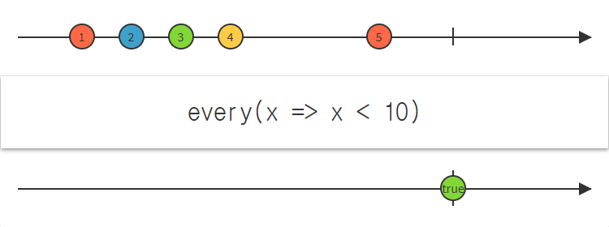

## 4.1 생성 연산자

### 4.1.1 `interval()` 함수

- __일정 시간 간격__으로 데이터 흐름을 생성
- 마블 다이어그램
  


- __두 가지__ 원형

  ```java
  @SchedulerSupport(SchedulerSupport.COMPUTATION)
  public static Observable<Long> interval(long period, TimeUnit unit);
  public static Observable<Long> interval(long initialDelay, long period, TimeUnit unit);
  ```

  - `@SchedulerSupport(SchedulerSupport.COMPUTATION)`은 __계산 스케줄러__에서 실행됨을 의미
  - 영원히 지속 실행되기 때문에 __폴링__ 용도로 많이 사용됨

### 4.1.2 `timer()` 함수

- `interval()` 함수와 유사하지만 __한 번만 실행__하는 함수
- 마블 다이어그램
  


- 원형

  ```java
  @SchedulerSupport(SchedulerSupport.COMPUTATION)
  public static Observable<Long> timer(long delay, TimeUnit unit);
  ```

  - `interval()` 함수와 마찬가지로 __계산 스케줄러__에서 실행됨

### 4.1.3 `range()` 함수

- 시작 숫자(n)부터 m개의 `Integer` 객체를 발행

- 마블 다이어그램
  

- 원형

  ```java
  @SchedulerSupport(SchedulerSupport.NONE)
  public static Observable<Integer> range(final int start, final int count);
  ```

  - __start__부터 __count__개 만큼 루프 돌림
  - 현재 스레드에서 실행됨


### 4.1.4 `intervalRange()` 함수

- `interval()` 함수와 `range()` 함수를 혼합해 놓은 함수

- 일정 시간 간격으로 시작 숫자(n)부터 m개 만큼 데이터를 발행

- `interval()` 함수처럼 무한히 데이터를 발행하지 않음

- 마블 다이어그램
  

- 원형

  ```java
  @SchedulerSupport(SchedulerSupport.COMPUTATION)
  public static Observable<Long> intervalRange(long start,
                                               long count,
                                               long initialDelay,
                                               long period,
                                               TimeUnit unit);
  ```

### 4.1.5 `defer()` 함수

- `timer()` 함수와 비슷

- 데이터 흐름 생성을 구독자가 `subscribe()` 함수 호출 전까지 미룰 수 있음

- 마블 다이어그램
  

- 원형

  ```java
  @SchedulderSupport(SchedulerSupport.NONE)
  public static <T> Observable<T> defer(
    Callable<? extends ObservableSource<? extends T>> supplier);
  ```

  - `Callable<Observable<T>>` 객체를 인자로 받음
  - 때문에 구독자가 `subscribe()` 함수를 호출하기 전에 `call()` 메서드 호출을 미룰 수 있음

- `defer()` 함수의 경우 __차가운__ `Observable`

### 4.1.6 `repeat()` 함수

- 단순 반복 실행

- 서버와 통신을 할 때 해당 서버가 잘 살아있는지 확인하는 코드 때문에 한 번쯤은 사용함

- 마블 다이어그램
  

- 원형

  ```java
  @CheckReturnValue
  @SchedulerSupport(SchedulerSupport.NONE)
  public final Observable<T> repeat(long times)
  ```

##4.2 변환 연산자

### 4.2.1 `concatMap()` 함수

- `flatMap()` 함수와 비슷

- `flatMap()` 함수의 경우 __interleaving (끼어들기)__ 가능

- `concatMap()` 함수의 경우 들어온 순서대로 처리 (큐?)

- 마블 다이어그램
  

- 원형

  ```java
  @CheckReturnValue
  @SchedulerSupport(SchedulerSupport.NONE)
  public final <R> Observable<R> concatMap(
    Function<? super T, ? extends ObservableSource<? extends R>> mapper);
  ```

### 4.2.2 `switchMap()` 함수

- __interleaving(끼어들기)__ 상황에서 순서를 보장하기 위해 기존에 진행 중이던 작업을 바로 중단

- 여러 개의 값이 발행되었을 때 가장 마지막에 들어온 값만 처리하고 싶을 때 사용

- 마블 다이어그램
  

- 원형

  ```java
  @CheckReturnValue
  @SchedulerSupport(SchedulerSupport.NONE)
  public final <R> Observable<R> switchMap(
    Function<? super T, ? extends ObservableSource<? extends R>> mapper);
  ```

### 4.2.3 `groupBy()` 함수

- 어떠한 기준으로 단일 `Observable`을 여러 개로 이루어진 `GroupObservable`로 만듦

- 마블 다이어그램
  

- 원형

  ```java
  @SuppressWarnings({ "unchecked", "rawtypes" })
  @CheckReturnValue
  @SchedulerSupport(SchedulerSupport.NONE)
  public final <K> Observable<GroupedObservable<K, T>> groupBy(
    Function<? super T, ? extends K> keySelector);
  ```

- 예제

  ```java
  String[] objs = { "6", "4", "2-T", "2", "6-T", "4-T" };
  Observable<GroupedObservable<Shape, String>> source = 
    Observable.fromArray(objs).groupBy(Shape::fromString);

  source.subscribe(
    obj -> obj.subscribe(
      val -> System.out.println("GROUP:" + obj.getKey() + "\t Value:" + val)));
  ```

  - `getKey()` 함수로 __구분된 그룹을 알 수 있음__

### 4.2.4 `scan()` 함수

- `reduce()` 함수와 비슷

- 중간 결과 및 최종 결과를 구독자에게 발행

- 마블 다이어그램
  

- 원형

  ```java
  @CheckReturnValue
  @SchedulerSupport(SchedulerSupport.NONE)
  public final Observable<T> scan(BiFunction<T, T, T> accumulator);
  ```


## 4.3 결합 연산자

- 여러 개의 `Observable`을 조합하여 활용하는 연산자
- 살펴볼 함수
  - `zip()` __함수__
  - `combineLatest()` __함수__
  - `merge()` __함수__
  - `concat()` __함수__

### 4.3.1 `zip()` 함수

- __(특징)__ 각각의 `Observable`을 활용해 2개 혹은 그 이상의 `Observable`을 결합


- 마블 다이어그램
  

- 원형

  ```java
  @SchedulerSupport(SchedulerSupport.NONE)
  public static <T1, T2, R> Observable<R> zip(
    ObservableSource<? extends T1> source1,
    ObservableSource<? extends T2> source2,
    BiFunction<? super T1, ? super T2, ? extends R> zipper);
  ```
  - `source1`과 `source2`를 결합해줄 `zipper` 변수에 원하는 함수를 넣으면 됨
  - 최대 9개의 `Observable`을 결합할 수 있으나 보통 __2 ~ 3개__면 충분

### 4.3.2 `combineLatest()` 함수

- 2개 이상의 `Observable`을 기반으로 `Observable` 각각의 값이 변경되었을 때 갱신

- 마블 다이어그램
  

- 원형

  ```java
  @SchedulerSupport(SchedulerSupport.NONE)
  public static <T1, T2, R> Observable<R> combineLatest(
    ObservableSource<? extends T1> source1, 
    ObservableSource<? extends T2> source2, 
    BiFunction<? super T1, ? super T2, ? extends R?> combiner);
  ```

  - `combiner`가 각 `Observable`을 결합하여 어떤 결과를 만들어주는 역할 (`zip()` 함수의 `zipper`와 동일)
  - 입력할 수 있는 `Observable` 인자 수는 최대 9개

### 4.3.3 `merge()` 함수

- __가장 단순한__ 결합 함수

- 입력 `Observable`의 순서와 모든 `Observable`이 데이터를 발행하는지 등에 관여 X

- __업스트림__에 먼저 입력되는 데이터를 그대로 발행

- 마블 다이어그램
  

- 원형

  ```java
  @SchedulerSupport(SchedulerSupport.NONE)
  public static <T> Observable<T> merge(
    ObservableSource<? extends T> source1, ObservableSource<? extends T> source2);
  ```

### 4.3.4 `concat()` 함수

- 2개 이상의 `Observable`을 이어 붙임

- 이전 `Observable`에서 `onComplete` 이벤트가 발생해야 다음 `Observable`을 구독

- 마블 다이어그램
  

- 원형

  ```java
  @SchedulerSupport(SchedulerSupport.NONE)
  public static <T> Observable<T> concat(
    ObservableSource<? extends T> source1,
    ObservableSource<? extends T> source2);
  ```

  - `onComplete` 이벤트의 발생 여부 확인이 중요

## 4.4 조건 연산자

- `Observable`의 흐름을 제어하는 역할
- 살펴볼 함수
  - `amb()` __함수__
  - `takeUtil(other)` __함수__
  - `skipUtil(other)` __함수__
  - `all()` __함수__

### 4.4.1 `amb()` 함수

- 가장 먼저 데이터를 발행하는 `Observable`을 선택

- 이후 나머지 `Observable`은 무시

- 마블 다이어그램
  

- 원형

  ```java
  @SchedulerSupport(SchedulerSupport.NONE)
  public static <T> Observable<T> amb(
    Iterable<? extends ObservableSource<? extends T>> sources);
  ```

### 4.4.2 `takeUntil()` 함수

- `take()` 함수에 조건을 설정한 형태

- 인자로 받은 `Observable`의 데이터 발행이 완료되면 현재 `Observable`의 데이터 발행을 중단하고 __즉시 완료__

- 마블 다이어그램
  

- 원형

  ```java
  @SchedulerSupport(SchedulerSupport.NONE)
  public final <U> Observable<T> takeUntil(Observable<U> other);
  ```

  - 비슷한 `skipWhile()` 함수가 있음

### 4.4.3 `skipUntil()` 함수

- `takeUntil()` 함수와 반대로 동작하는 함수

- 인자로 받은 `Observable`이 데이터를 발행할 때까지 데이터 발행을 건너뜀

- 마블 다이어그램
  

- 원형

  ```java
  @SchedulerSupport(SchedulerSupport.NONE)
  public final <U> Observable<T> skipUntil(ObservableSource<U> other);
  ```

### 4.4.4 `all()` 함수

- 주어진 조건에 __100%__ 맞을 때만 `true` 값을 발행

- 마블 다이어그램
  

- 원형

  ```java
  @SchedulerSupport(SchedulerSupport.NONE)
  public final Single<Boolean> all(Predicate<? super T> predicate);
  ```

  - 주어진 인자가 `true`인지 `false`인지 판단

## 4.5 수학 및 기타 연산자

### 4.5.1 수학 함수

- 확장 모듈 중 하나인 __RxJava2Extensions__를 활용

  ```
  compile "com.github.akarnokd:rxjava2-extensions:0.17.6"
  ```

  - 그래들 dependencies 블록에 위를 추가

- 종류

  ```java
  public final Single<Long> count();
  public static <T extends Comparable<? super T>> Flowable<T> max(Publisher<T> source);
  public static <T extends Comparable<? super T>> Flowable<T> min(Publisher<T> source);
  public static Flowable<Integer> sumInt(Publisher<Integer> source);
  public static Flowable<Double> averageDouble(Publisher<? extends Number> source);
  ```

### 4.5.2 `delay()` 함수

- 입력 받은 시간 + 단위만큼 `Observable`의 데이터 발행을 지연

- 마블 다이어그램
  

- 원형

  ```java
  @SchedulerSupport(SchedulerSupport.COMPUTATION)
  public final Observable<T> delay(long delay, TimeUnit unit);
  ```

### 4.5.3 `timeInterval()` 함수

- 어떤 값을 발행했을 때 이전 값을 발행한 이후 얼마의 시간이 흘렀는지 알려줌

- 마블 다이어그램
  

- 원형

  ```java
  @SchedulerSupport(SchedulerSupport.NONE)
  public final Observable<Timed<T>> timeInterval();
  ```

  ​