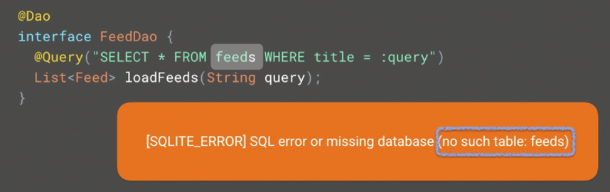
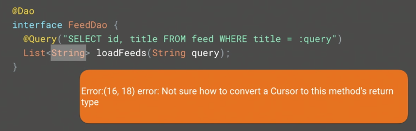
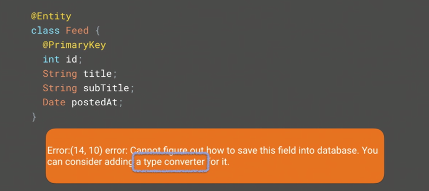
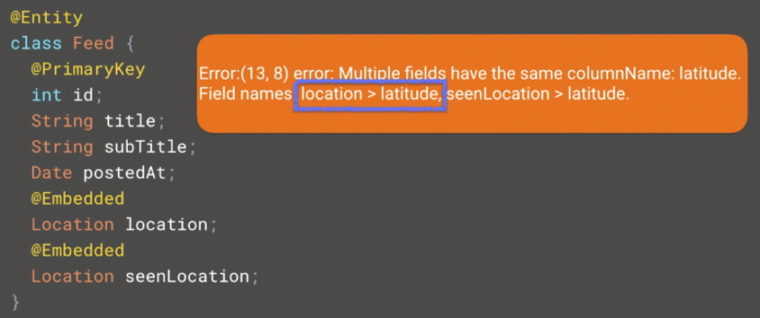

## Architecture Components - Persistence and Offline

### Room: An Object Mapping Library for SQLite

```java
String sql = "SELECT id, title, subTitle FROM feed WHERE title = :qurey";
```

- 단박에 이해가 힘들다.

```java
@Query("SELECT id, title, subTitle FROM feed WHERE title = :query")
List<Feed> loadFeeds(String query);
```

- 쿼리가 어떤 처리를 할 것인지 이해하기 쉽다.

```java
@Dao
interface FeedDao {
	@Query("SELECT id, title, subTitle FROM feed WHERE title = :query")
	List<Feed> loadFeeds(String query);
}

@Entity
class Feed {
	@PrimaryKey
    int id;
    String title;
    String subTitle;
}

@Database(entities = {Feed.class}, version = 1)
abstract class MyDatabase extends RoomDatabase {
    abstract FeedDat feedDat();
}
```

- `MyDatabase`는 여러 __entity__, __DAO__를 가질 수 있다.

```java
Room.databaseBuilder(getApplicationContext(), MyDatabase.class).build();
```

- 빌더를 통해서 Database를 생성하며 이는 Retrofit이나 Dagger와 비슷하다.

```java
@Dao
interface FeedDao {
	@Insert
	void insert(Feed feed);

	@Insert
	void insertBoth(Feed feed1, Feed feed2);

	@Insert
	void insertAll(List<Feed> feed);

	@Insert
	void insertAll(Feed... feed);
}
```

- 다양한 Argument들을 정의할 수 있다.

```java
@Dao
interface FeedDao {
	@Insert(onConflict = REPLACE)
	void insertAll(Feed... feed);
}
```

- unique key에 충돌이 발생했을 때 어떻게 할 것인지 정의할 수 있다.

```java
@Dao
interface FeedDao {
	@Delete
	void delete(Feed feed);

	@Update
	void update(Feed feed);
}
```

- Delete와 Update도 Insert와 유사하게 구현 가능하다.

```java
@Dao
interface FeedDao {
	@Query("SELECT * FROM feed WHERE id IN(:ids)")
	List<Feed> loadFeeds(int... ids /* int[] ids, List<Integer> ids */);
}
```

- 여러 id에 대한 아이템들을 반환하고 싶은 경우

- 위와 같은 다양한 파라미터들을 사용한다.

  ​

### Room Speaks SQL

- Room에 대한 가장 중요한 부분
- Room은 컴파일하고 코드를 생성하는 과정에서 개발자가 작성한 코드를 이해한다.

```java
@Dao
interface FeedDao {
	@Query("SELECT * FROM feed WHERE title = :query")
	List<Feed> loadFeeds(String query);
}
```

- SQLite의 __feed__ 테이블과 코드상의 `Feed` 클래스가 일치하는지 확인한다.
- Room은 java code와 비슷한 validation check을 제공한다.





- 두 에러는 개발자의 오타로 발생한다.


- 해당 경고는 두 가지 해결책이 있다.

```java
// ignore warning
@Dao
interface FeedDao {
	@SupperessWarnings(RoomWarnings.CURSOR_MISMATCH)
	@Query("SELECT subTitle FROM feed WHERE title = :query")
	List<Feed> loadFeeds(String query);
}

// collect type
@Dao
interface FeedDao {
	@Query("SELECT subTitle FROM feed WHERE title = :query")
	List<String> loadFeeds(String query);
}
```



- 이런 경우에는 아래와 같이 해결해야 한다.

```java
@Dao
interface FeedDao {
	@Query("SELECT id, title FROM feed WHERE title = :query")
	List<Pojo> loadFeeds(String query);

	class Pojo {
		int id;
		String title;
    }
}
```


### TypeAdapters

Room은 자동적으로 모든걸 해주지만, 개발자 추가한 클래스에 대해서는 모름

- 아래와 같은 `Feed` 클래스를 보자

```java
@Entity
class Feed {
	@PrimaryKey
	int id;
	String title;
	String subTitle;
	// non primitive type
	Date postedAt;
}
```

- `Date` 클래스가 추가된다면 무슨 일이 벌어질까?



- "어떻게 저장할지 모르니 __type converter__를 추가하시오."
- 라는 에러 메시지를 받는다.

```java
public class MyConverters {
	@TypeConverter
	public static Long dateToLong(Date date) {
		return date == null ? null : date.getTime();
    }

	@TypeConverter
	public static Date longToDate(Long time) {
		return time == null ? null : new Date(time);
    }
}
```

- 해당 케이스에서 __type converter__

```java
@Entity
class Feed {
	@PrimaryKey
	int id;
	String title;
	String subTitle;
	@TypeConveters(MyConverters.class)
	Date postedAt;
}

@Entity
@TypeConveters(MyConverters.class)
class Feed {
	@PrimaryKey
	int id;
	String title;
	String subTitle;
	Date postedAt;
}

@Dao
@TypeConveters(MyConverters.class)
interface FeedDao {
	@Query("SELECT id, title FROM feed WHERE title = :query")
	List<Pojo> loadFeeds(String query);
}

@Dao
interface FeedDao {
	@TypeConveters(MyConverters.class)
	@Query("SELECT id, title FROM feed WHERE title = :query")
	List<Feed> loadFeeds(String query);
}

@Database(entities = {Feed.class}, version = 1)
@TypeConveters(MyConverters.class)
abstract class MyDatabase extends RoomDatabase {
    abstract FeedDat feedDat();
}
```

- 위와 같이 __@TypeConverter__를 지정할 수 있음


```java
@Dao
interface FeedDao {
	@Query("SELECT * FROM feed WHERE postedAt BETWEEN :from AND :to")
	List<Feed> loadFeeds(Date from, Date to);
}
```

- 이렇게 사용하면 됨


### Embedded

__@TypeConverter__보다 복잡한 상황에서 사용?

```java
@Entity
class Feed {
	@PrimaryKey
	int id;
	String title;
	String subTitle;
	Date postedAt;
	Location location;
}

class Location {
	double latitude;
	double longitude;
}
```

- 사용자 정의 클래스는 어떻게 해석할 것인가?

```java
@Entity
class Feed {
	@PrimaryKey
	int id;
	String title;
	String subTitle;
	Date postedAt;
	@TypeAdapters(LocationTypeAdapter.class)
	Location location;
}

class Location {
	double latitude;
	double longitude;
}
```

|  id  | title | subTitle | postedAt | location |
| :--: | :---: | :------: | :------: | :------: |
| ...  |  ...  |   ...    |   ...    |   ...    |

- 첫 번째 방법은 __@TypeAdapters__를 사용하는 것... (__@TypeConverters__가 아니고?)
- `LocationTypeAdapter`에서 어떻게 인코딩, 디코딩 할지를 정의해 줘야 한다.
- `Location` 클래스는 그래도 쉬운 편이다.

```java
@Entity
class Feed {
	@PrimaryKey
	int id;
	String title;
	String subTitle;
	Date postedAt;
	double latitude;
	double longitude;
}

class Location {
	double latitude;
	double longitude;
}
```

|  id  | titile | subTitle | postedAt | latitude | longtitude |
| :--: | :----: | :------: | :------: | :------: | :--------: |
| ...  |  ...   |   ...    |   ...    |   ...    |    ...     |

- 두 번째 방법은 `Location` 클래스의 필드를 그대로 `Feed`에 넣는다.
- 캡슐화 원칙이 지켜지지 않는다.

```java
@Entity
class Feed {
	@PrimaryKey
	int id;
	String title;
	String subTitle;
	Date postedAt;
}

@Entity
class Location {
	@PrimaryKey
	int feedId;
	double latitude;
	double longitude;
}
```

|  id  | title | subTitle | postedAt |
| :--: | :---: | :------: | :------: |
| ...  |  ...  |   ...    |   ...    |

| feedId | latitude | longitude |
| :----: | :------: | :-------: |
|  ...   |   ...    |    ...    |

- DB 측면에서 본다면 그렇게 아름다운 테이블 구조는 아니다.
- 데이터 모델 클래스에 대해서 설명했던 부분을 수정해야 한다. (???)

```java
@Entity
class Feed {
	@PrimaryKey
	int id;
	String title;
	String subTitle;
	Date postedAt;
	@Embedded
	Location location;
}

class Location {
	double latitude;
	double longitude;
}
```

- __@Embedded__를 사용하면 __Room__은 테이블을 아래와 같이 생성

|  id  | title | subTitle | postedAt | latitude | longitude |
| :--: | :---: | :------: | :------: | :------: | :-------: |
| ...  |  ...  |   ...    |   ...    |   ...    |    ...    |

```java
@Dao
interface FeedDao {
	@Query("SELECT * FROM feed WHERE" +
           "latitude BETWEEN :lat1 AND :lat2" +
           " longitude BETWEEN :long1 AND :long2")
	List<Feed> loadFeeds(double lat1, double lat2,
                         double long1, double long2);
}
```

- __@Embedded__로 인해서 요롷게 혹은

```java
@Dao
interface FeedDao {
	@Query("SELECT langtitue, longitude FROM feed WHERE id = :feedId")
	Location getLocation(int feedId);
}
```

- 요런식으로 쓸 수 있다. (물론.. __@TypeAdapters__로도 할 순 있음)

```java
@Entity
class Feed {
	@PrimaryKey
	int id;
	String title;
	String subTitle;
	Date postedAt;
	@Embedded
	Location location;
	@Embedded
	Location seenLocation;
}
```

- 만약 위와 같이 같은 중첩 클래스의 인스턴스가 있다면?



|  id  | title | subTitle | postedAt | latitude | longitude | latitude | longitude |
| :--: | :---: | :------: | :------: | :------: | :-------: | :------: | --------- |
| ...  |  ...  |   ...    |   ...    |   ...    |    ...    |   ...    |           |

- 당연히 에러...

```java
@Entity
class Feed {
	@PrimaryKey
	int id;
	String title;
	String subTitle;
	Date postedAt;
	@Embedded
	Location location;
	@Embedded(prefix = "seen_")
	Location seenLocation;
}
```
|  id  | title | subTitle | postedAt | latitude | seen_longitude | seen_latitude | longitude |
| :--: | :---: | :------: | :------: | :------: | :------------: | :-----------: | --------- |
| ...  |  ...  |   ...    |   ...    |   ...    |      ...       |      ...      |           |

- 위와 같은 방식으로 해결 가능


### Observerbility

```java
// Architecture Components
@Dao
interface FeedDao {
	@Query("SELECT * FROM feed WHERE title = :query")
	LiveData<List<Feed>> loadFeed(String query);
}

// Rxjava2
@Dao
interface FeedDao {
	@Query("SELECT * FROM feed WHERE title = :query")
	Flowable<List<Feed>> loadFeed(String query);
}
```

- 자세한 사용 예제는 영상 참고


### Relations

SQLite는 관계형 DB기 때문에 __Room__도 이와 관련된 기능을 지원함

#### Entities inside Entities

```java
@Entity
class Feed {
	@PrimaryKey
	int id;
	String title;
	String subTitle;
	Date postedAt;
	User user;
}

@Entity
public class User {
	@PrimaryKey
	int id;
	String userName;
}
```


- Why?

```java
@Dao
interface FeedDao {
	@Query("SELECT * FROME feed WHERE id = :feedId")
	public Feed getFeed(int feedId);
}
```

- `Feed` 클래스 안에 있는 `User` 클래스의 정보가 fetch 되었나?

#### Lazy loading

```java
@Entity
class Feed {
	@PrimaryKey
	int id;
	String title;
	String subTitle;
	Date postedAt;
	private int userId;
	private User user;

	// lazy loading...
	public User getUser() {
		if (user == null) {
			user = db.fetch(userId);
		}

		return user;
    }
}

// RecyclerView
void onBindViewHolder(ViewHolder viewHolder, int position) {
	Feed feed = items.get(position);
	title.setText(feed.getTitle());
	subTitle.setText(feed.getSubTitle());
	author.setText(feed.getUser().getUsername());
}
```

- `feed.getUser()` __lazy loading__으로 인해 __ANR__이 발생할 가능성이 있음

#### Joins

```java
@Query("SELECT title, subTitle, userName FROM feed, user " +
       "WHERE feed.userId = user.id")
List<Item> loadItems();

public class Item {
	public final String title;
	public final String subTitle;
	public final String userName;

  	public Item(String title, String subTitle, String userName) {
		this.title = title;
		this.subTitle = subTitle;
		this.userName = userName;
    }
}
```

#### Foreign Key

```java
@Entity(foreignKeys = @ForeignKey(entity = User.class,  parentColums = "id", childColumns = "userId")
        onDelete = RESTRICT
        onUpdate = CASCADE)
class Feed {
	@PrimaryKey
	int id;
	String title;
	String subTitle;
	Date postedAt;
	int userId;
}

@Entity
public class User {
	@PrimaryKey
	int id;
	String userName;
}
```

#### Indexing

```java
@Dao
interface FeedDao {
	@Query("SELECT * FROM feed WHERE title = :query")
	List<Feed> loadFeeds(String query);
}
```

- 테이블 전체 스캔 진행

```java
// Index
@Entity(indices = @Index("title"))
class Feed {
	@PrimaryKey
	int id;
	String title;
	String subTitle;
	Date postedAt;
	int userId;
}

@Query("SELECT * FROM feed WHERE title = :query")

// Composite Indexes
@Entity(indices = @Index("title", "subTitle"))
class Feed {
	@PrimaryKey
	int id;
	String title;
	String subTitle;
	Date postedAt;
	int userId;
}

@Query("SELECT * FROM feed WHERE title = :query OR subTitle = :query")

// Multiple Indexes
@Entity(indices = {
		@Index("title", "subTitle"),
  		@Index("userId")})
class Feed {
	@PrimaryKey
	int id;
	String title;
	String subTitle;
	Date postedAt;
	int userId;
}
```

- __Index__ 지정을 통해 속도를 높일 수 있다.


### Testing, Migration, Testing  Migration

- 영상 참고