## ConstraintLayout

### Description


- Unified and expressive way to create Layouts
  - 모든 유형의 레이아웃을 만들 수 있음
- __Flat Layouts__
  - 가장 강조하고 싶은 부분
  - 성능에 영향을 주기 때문에 평평한 레이아웃은 이것에 대한 많은 이득을 가져옴
- Deep integration with Android Studio & the Layout Editor
  - Android Studio에서 레이아웃을 수정하기 위한 여러가지 툴들을 제공
- Unbundled Library
  - 언제든지 새로운 버전에 푸시할 수 있음을 의미


### 1.0

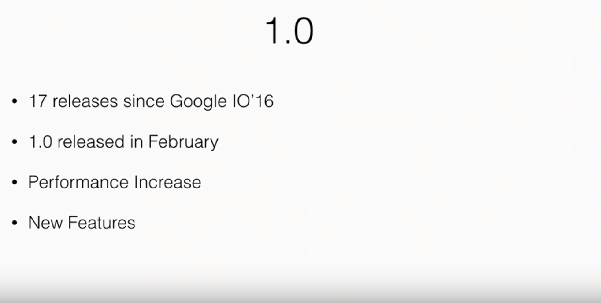

- 화면을 만들 때 __default layout__이 `RelativeLayout`에서 `ConstraintLayout`으로 변경

### 1.0 New Features

- Relative positioning

  


- Center positioning & bias

  


- Guidelines

  


- Chains

  


- Ratio

  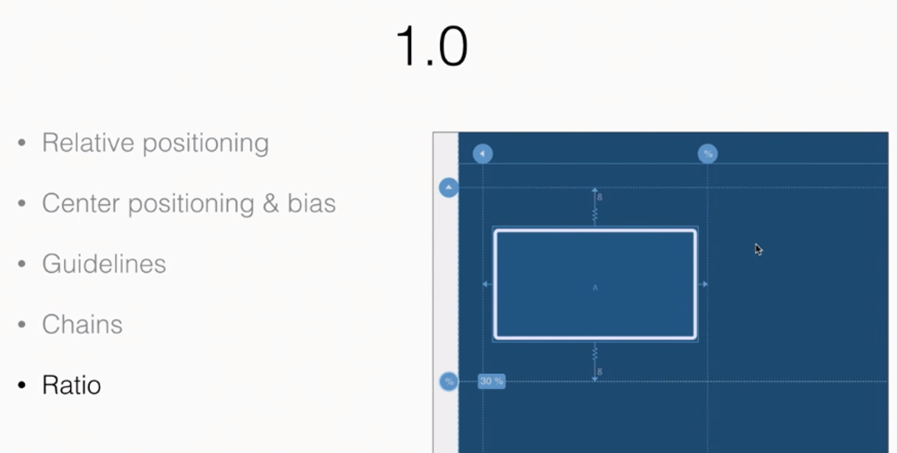

### 1.1.0 beta1

- Barriers

  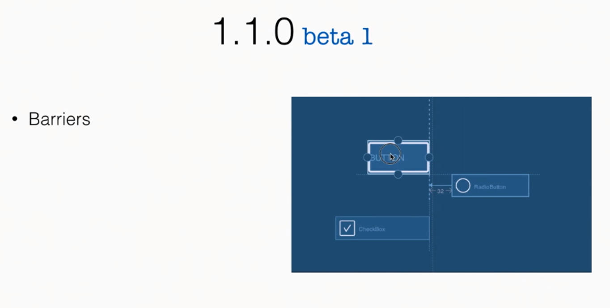


- Group

  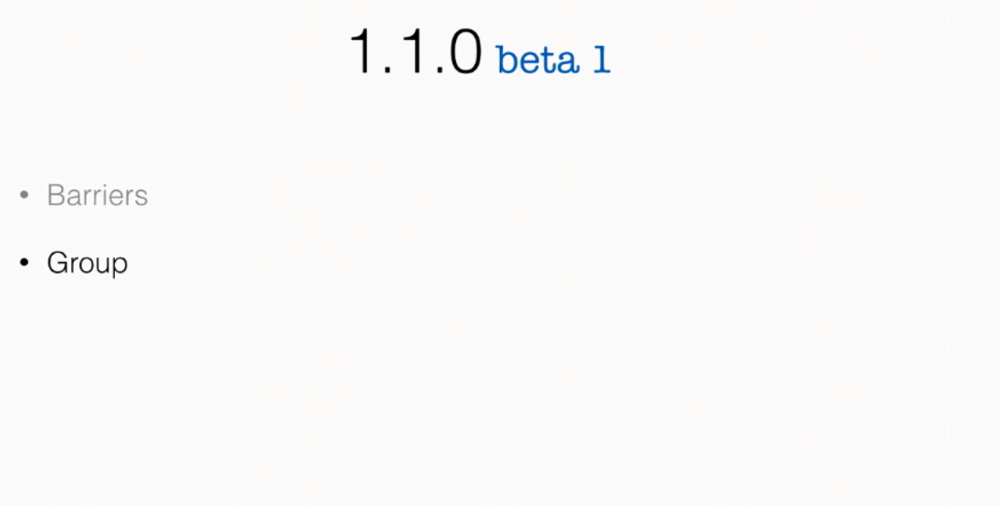

## Advanced Designer

### Tools

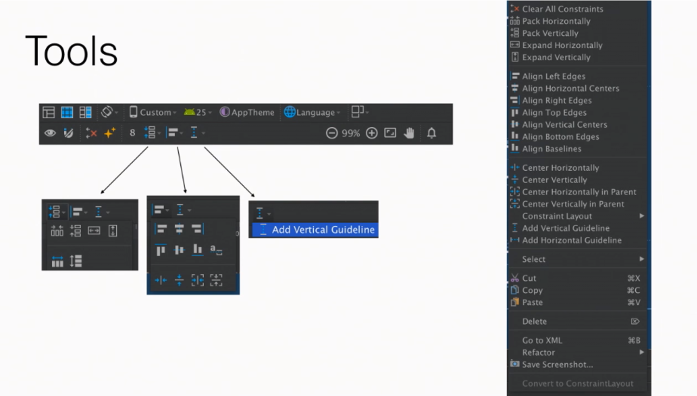

### Tools Attributes

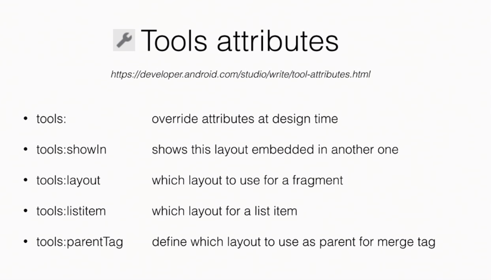

- 런타임에 결정되는 것을 레이아웃 편집기에 적용할 수 있도록 함

### Sample Data


- `RecyclerView`에서 런타임에 리스트 아이템 UI를 확인하지 않아도 됨

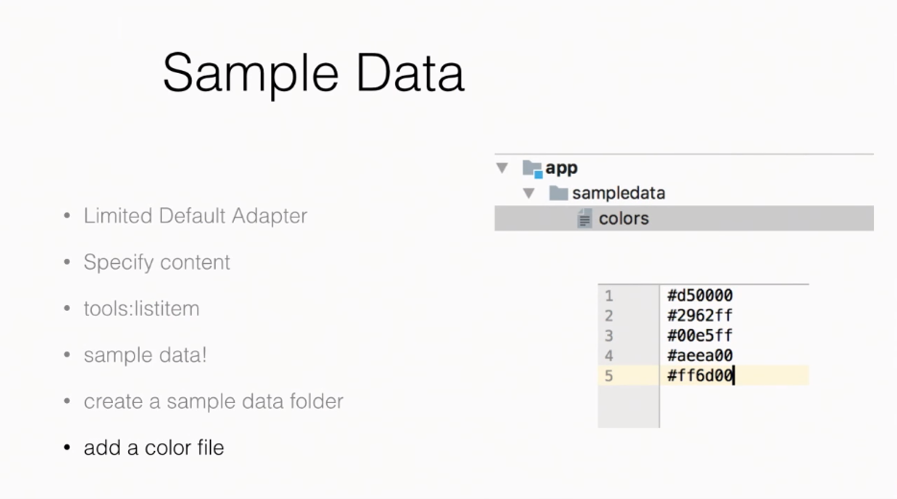

- 컬러의 경우 __sampledata__ 폴더 하위에 만들면 됨

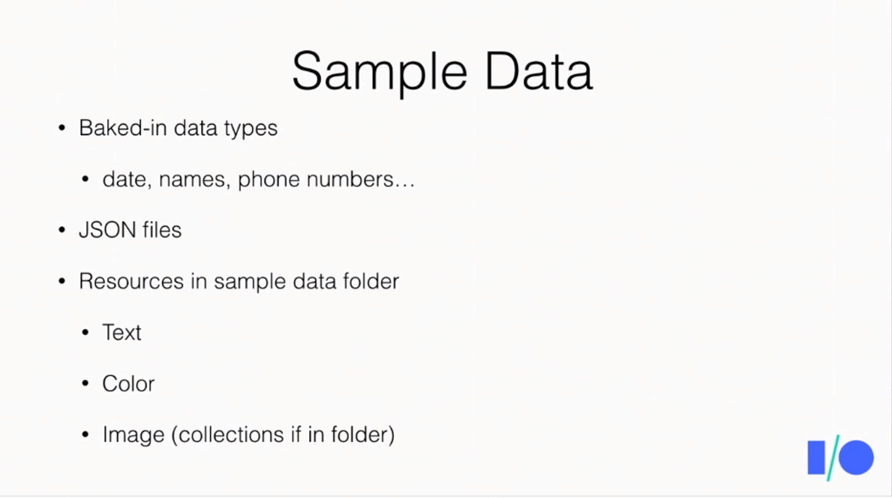

### Placeholder


- 위젯을 이동할 수 있는 영역? 공간? 내가 갈 자리를 표시하는 녀석?
- __Placeholder__ 기반의 UI를 구현하려면 `merge` 태그를 사용하여야 함

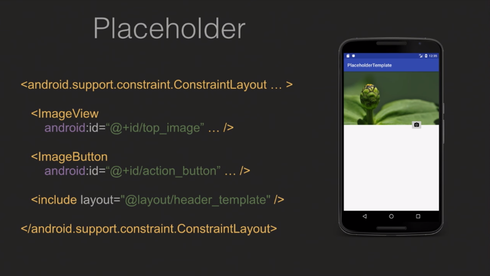

- 위젯뿐만 아니라 `include` 태그를 이용해 layout 자체를 가져올 수도 있음

## ConstraintSet

### Idea

- ConstaintLayout이 나온 배경은 납작한 레이아웃을 만들기 위해
  모든 위젯들을 같은 계층과 같은 레벨로 있게 해줌
- ConstraintSet의 아이디어는 간단함
  ConstraintSet에 들어가는 모든 객체들에 같은 제약(constraints)을 적용하는 것
- 레이아웃 파일로부터 ConstraintSet을 만들거나 포함시킬 수 있음

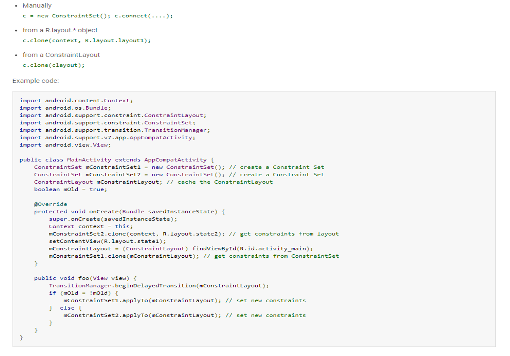

- 이는 매우 강력한데, 런타임에 ui 조작이 매우 쉬워짐


- 뷰를 완전히 분리할 수 있다 (레이아웃의 캡슐화)
- 다른 제약을 건 ConstraintSet사이에 reload 없이 스위칭할 수 있음

### Transition

- 모든 ConstraintSet에 애니메이션을 적용하는 방법

```java
// 요 한 줄이면 됨
TransitionManager.beginDelayedTransition(mConstraintLayout);
```

- 커스텀한 애니메이션은 아래와 같이하면 됨

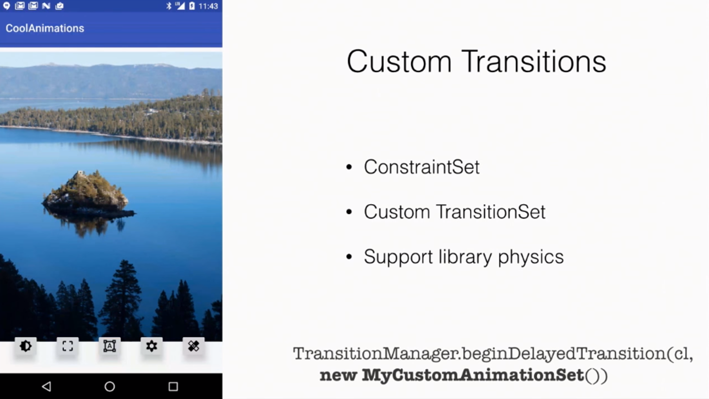