## ART Memory Improvements

### Decription

- 작년에 ART에 대한 설명은 시작에 불과
- 주요 부품(?)만 로드되게 함으로써 더 빠르게 앱이 로드되고 더 적은 메모리를 앱이 사용하도록 함
- 더 적은 메모리를 앱이 사용한다고 하는 것은 아래와 같음
  - __reclaimed time__, __allocated time__이 단축됨
- JIT를 사용하면 훨씬 빠르게 실행되도록 할 수 있음

### Profile-guided dex file layout

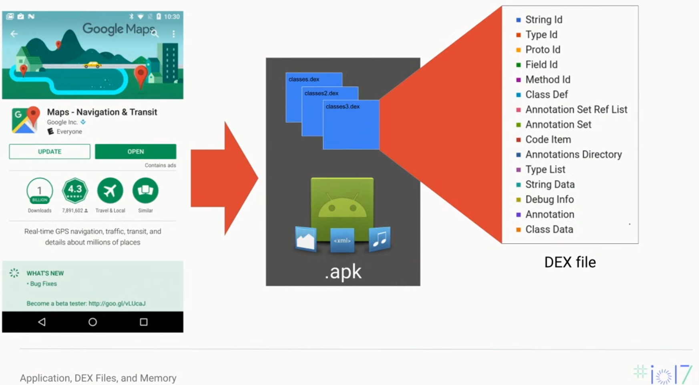

- Dex 파일을 통해 많은 정보를 얻게됨 (클래스 계층 구조 등)
- 이 Dex 파일은 ART에 의해 메모리에 로드됨
- 이 파일을 로드하는 데는 RAM과 시작 시간 비용이 듦

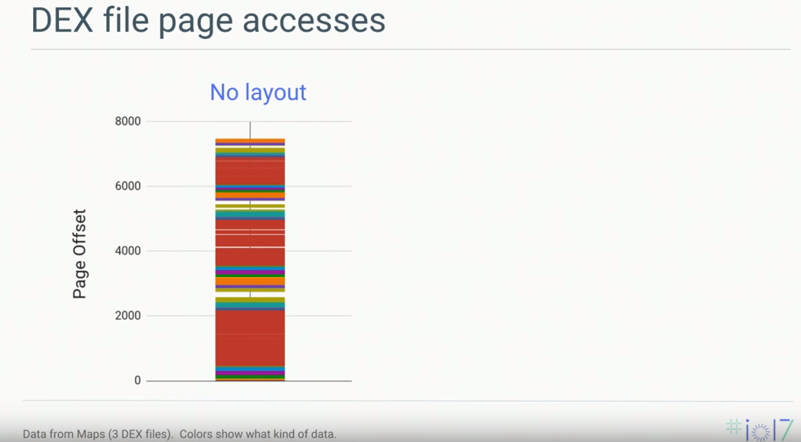

- 메모리는 Dex 파일을 읽어드려 위처럼 수천 페이지로 보이게 됨
- 메가단위의 정보가 메모리에 로드됨

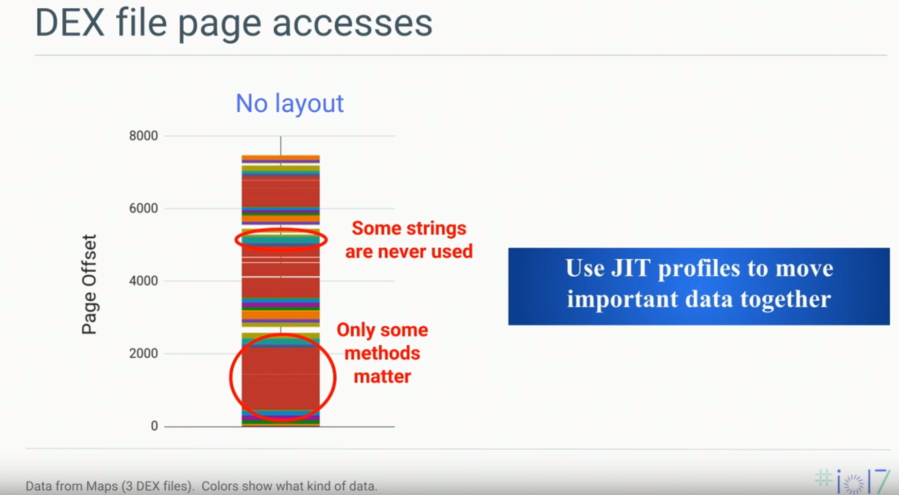

- 같은 페이지 안에는 일부 중요하지 않는 것도 있음
  - 일부 함수만 사용(?)
  - 사용되지 않는 문자열
- Android N에서 ART는 __프로파일 기반__의 컴파일이 도입
- Android O에서는 이 부분을 좀 더 영리하게 사용함
- [Dex 파일의 Locality(?)]()를 개선하고 있는데,
  아이디어는 __JIT 프로파일을 사용__하여 중요한 데이터를 함께 이동시킴

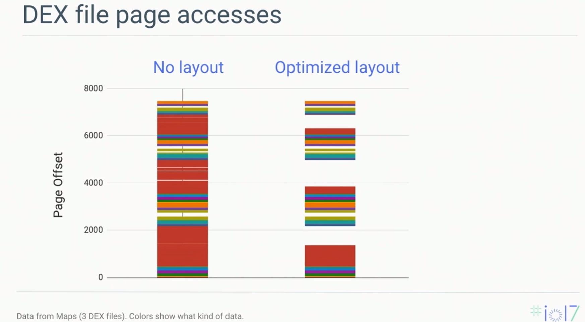

- 중요한 함수를 중요하지 않은 함수와 함께 둠
- 이러한 결과로 페이지 수가 많이 줄어듦 (특히 함수 부분)

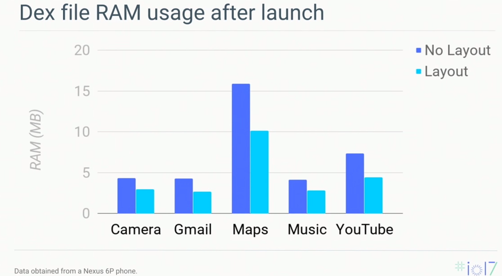

- 상당한 메모리 사용율 감소가 있었음

### New Garbage Collector 

- [Android GC에 대한 설명](https://www.youtube.com/watch?v=pzfzz50W5Uo&index=14&list=PLq_uWB0WqY0tVIrFZ41Wr5BZc9B_wf-XW) - Android Performance Patterns

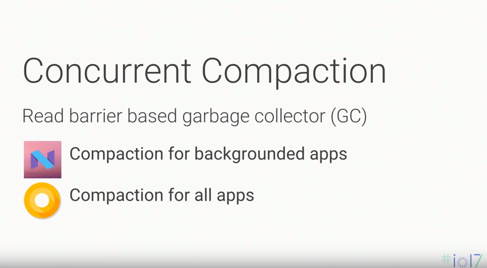

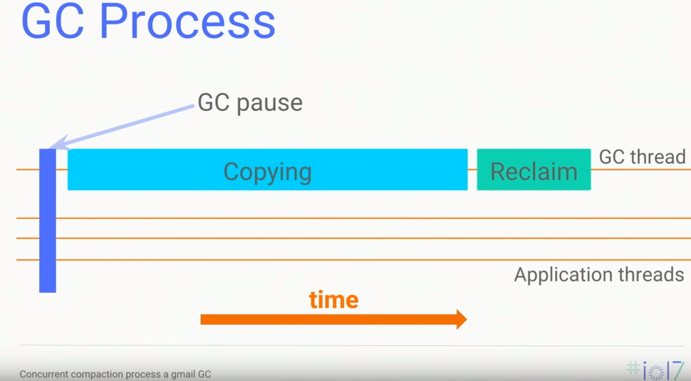

- 새 GC는 Region-Based임
- GC하는 부분은 세 가지 Phase로 나뉨
  - Pause Phase
    - Pause Phase는 모든 쓰레드들을 멈춤(?)
    - 대피할 영역(Source Region)을 확인
    - 모든 쓰레드들을 깨움(?)
  - Copying Phase
    - GC Phase 중 가장 큰 부분을 차지
    - Source regions에서 Destination regions으로 복사함
  - Reclaim Phase
    - Source regions에 대한 RAM을 해제함

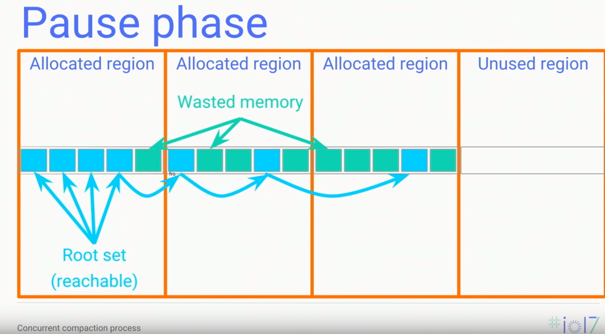

- 대피할 곳(Source Region)을 확인(선정)
- 대피의 목적은 높은 분열 지역(region with high fragmentation) 밖으로 복사하기 위한 것
- 위에 예제에서는 중앙의 두 영역을 선택함 (20% 이하로 분열되었기 때문)

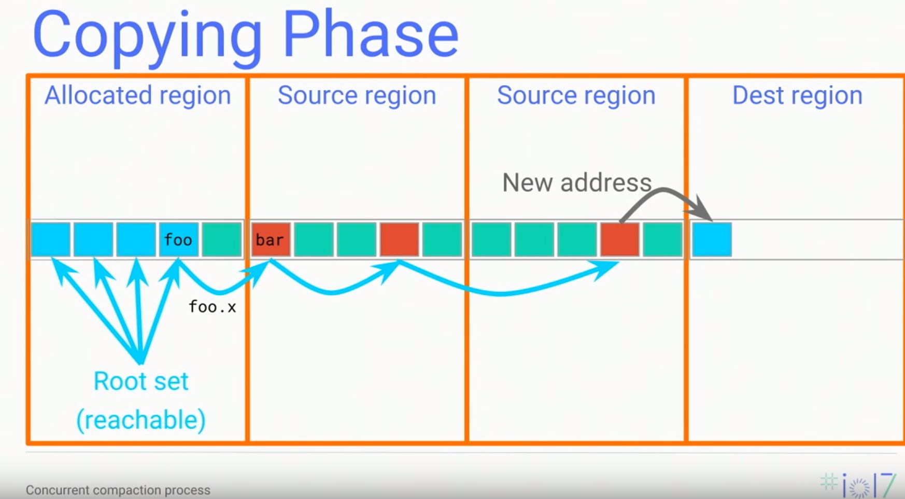

g

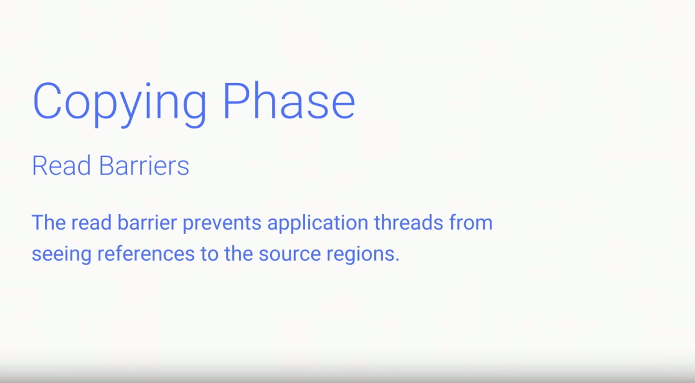

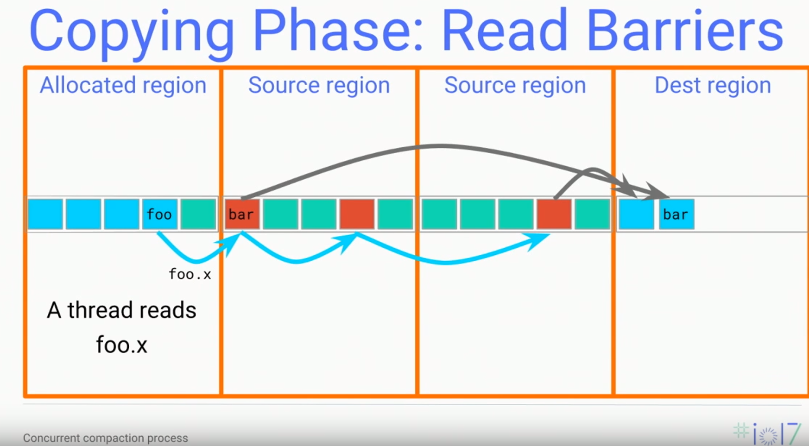

### Android Performance Case Study: Sheets

- [Google Sheets 앱](https://play.google.com/store/apps/details?id=com.google.android.apps.docs.editors.sheets)을 예제로 Nougat에서 Oreo로 오면서 얼마만큼 성능이 향상되었는지 지표로 보여줌

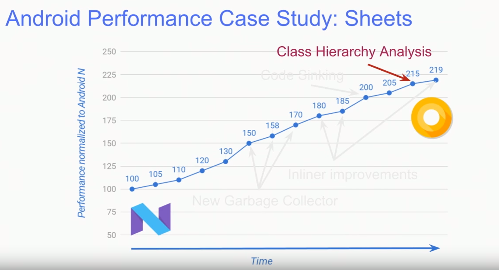

- New Garbage Collector
- Inliner improvements
- Code Sinking
- Class Hierachy Analysis

### Loop Optimizations

