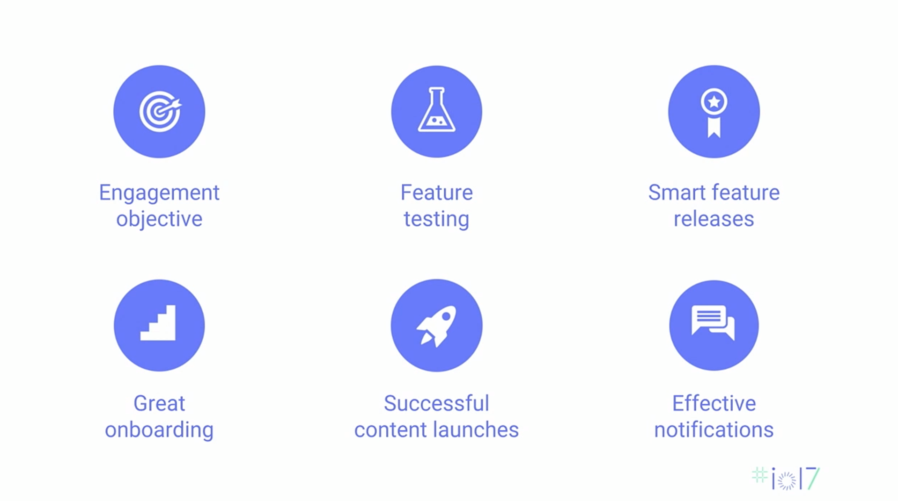
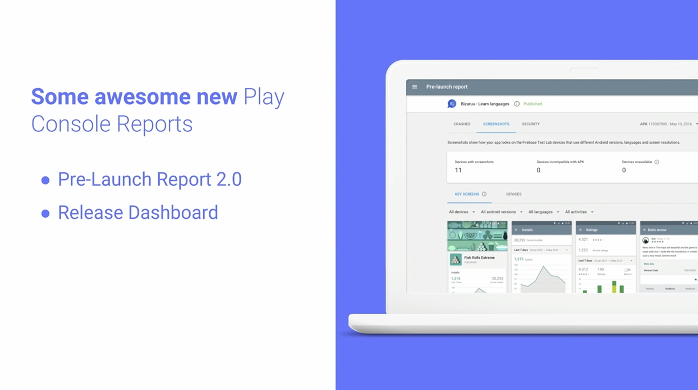
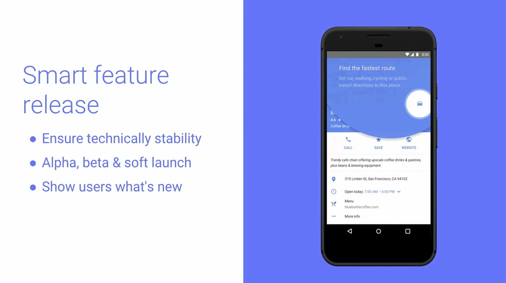
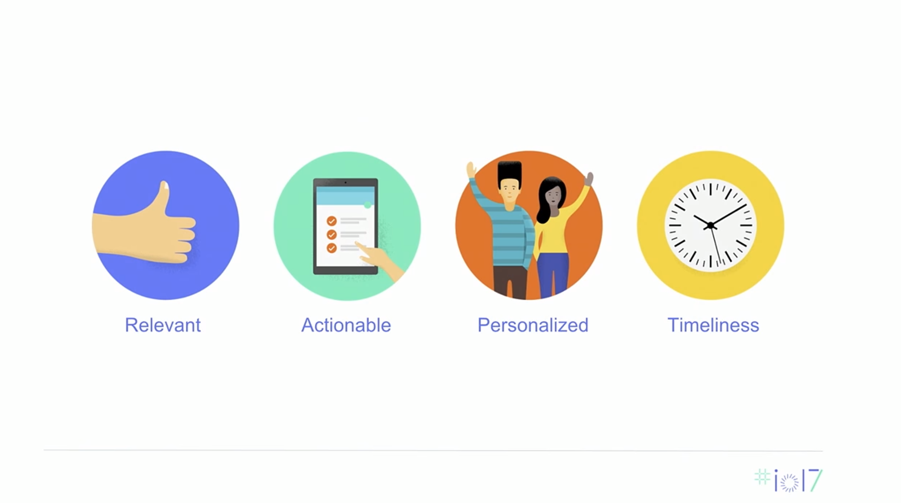

## 시작

- 사용자 참여도를 높이기 위해선 위 6가지의 tool & tip을 활용하면 좋음

## 목표를 명확히 정의하라

- 실제 많은 사람들이 사용 중인 앱을 사례로 듦
  - __[Airbnb](https://play.google.com/store/apps/details?id=com.airbnb.android&hl=ko)__ : 예약 하는 것 _nitghts booked?_
  - __[EyeEm](https://play.google.com/store/apps/details?id=com.baseapp.eyeem&hl=ko)__ : 사진을 업로드
  - __[YouTube](https://play.google.com/store/apps/details?id=com.google.android.youtube&hl=ko)__ : 시청 시간
  - __[Onefootball](https://play.google.com/store/apps/details?id=de.motain.iliga&hl=ko)__ : 기사 읽기
- __Why?__ 이렇게 하면 앱을 최적화할 수 있어서 사용자 참여도를 높일 수 있음

## 기능을 테스트하라

- 대규모 사용자가 있는 환경에서 엉망이 되지 않으려면
  기술적으로 안정적이어야 하며
  사용자에게 무엇이 변경되었는지 알려줘야 함

- __Google Play Console__ 활용
- __더 많은 테스트 커버리지를 개발자에게 제공__ : 기기의 주요 화면을 볼 수 있음
- __매시간 데이터와 관련하여 릴리즈에 대한 업데이트가 제공__

## 현명하게 릴리즈하라

- __기술적으로 안정적이어야 함__ : Google Play 별표 리뷰의 피드백들을 통해 한 50%(?) 확인할 수 있음
- __Alpha, beta & soft launch__ : __Google Play Console__ 이용해 점차 완전한 release를 향해 가라
- __Show users what's new__ : 사용자들에게 무엇이 새로워졌는지 알려줘라

## 온보딩을 적극활용하라

- [온보딩과 관련된 블로그 글](https://brunch.co.kr/@blackindigo-red/16)

## 전략적으로 콘텐츠를 출시하라

- __Live Ops__ _실시간 작업?_ 

  - 사용자들에게 매일 새로운 것을 경험하게 하는 것
  - 새로운 경험을 통해 수익 창출과 유저 이탈률을 줄임

  - __Live Ops__ 세 가지 구성요소를 봄
    - __컨텐츠__
    - __판매__
    - __이벤트__
  - __게임 개발자__ 용으로는 위 세가지의 조합이 매우 성공적

## 효과적인 알림에 대한 팁을 따르라

- __관련성__ : 옵션으로 관련성과 연관된 데이터를 수집할 수 있도록
- __실행 가능성__ : 사용자가 특정 작업을 수행할 수 있도록
- __개인화__ : 사용자는 모두 다른 것을 원하기 때문에 거기에 맞춰도록
- __적시성__ : 적절한 시간에 적절한 메시지를 보내도록
- __Tool & Tip__ : __[Firebase 알림](https://firebase.google.com/docs/cloud-messaging/?hl=ko)__