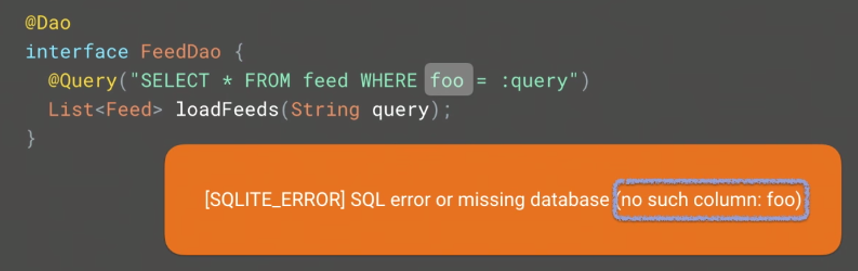
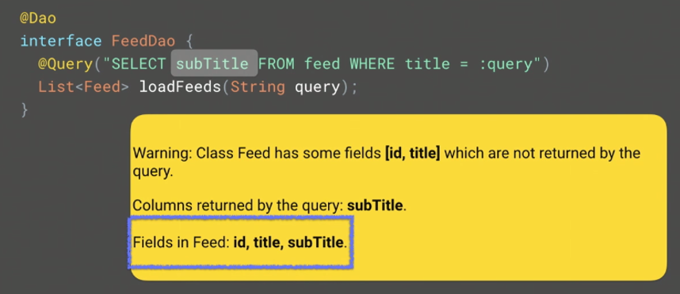

## Architecture Components - Persistence and Offline

### Room: An Object Mapping Library for SQLite

```java
String sql = "SELECT id, title, subTitle FROM feed WHERE title = :qurey";
```

- 단박에 이해가 힘들다.

```java
@Query("SELECT id, title, subTitle FROM feed WHERE title = :query")
List<Feed> loadFeeds(String query);
```

- 쿼리가 어떤 처리를 할 것인지 이해하기 쉽다.

```java
@Dao
interface FeedDao {
	@Query("SELECT id, title, subTitle FROM feed WHERE title = :query")
	List<Feed> loadFeeds(String query);
}

@Entity
class Feed {
	@PrimaryKey
    int id;
    String title;
    String subTitle;
}

@Database(entities = {Feed.class}, version = 1)
abstract class MyDatabase extends RoomDatabase {
    abstract FeedDat feedDat();
}
```

- `MyDatabase`는 여러 __entity__, __DAO__를 가질 수 있다.

```java
Room.databaseBuilder(getApplicationContext(), MyDatabase.class).build();
```

- 빌더를 통해서 Database를 생성하며 이는 Retrofit이나 Dagger와 비슷하다.

```java
@Dao
interface FeedDao {
	@Insert
	void insert(Feed feed);

	@Insert
	void insertBoth(Feed feed1, Feed feed2);

	@Insert
	void insertAll(List<Feed> feed);

	@Insert
	void insertAll(Feed... feed);
}
```

- 다양한 Argument들을 정의할 수 있다.

```java
@Dao
interface FeedDao {
	@Insert(onConflict = REPLACE)
	void insertAll(Feed... feed);
}
```

- unique key에 충돌이 발생했을 때 어떻게 할 것인지 정의할 수 있다.

```java
@Dao
interface FeedDao {
	@Delete
	void delete(Feed feed);

	@Update
	void update(Feed feed);
}
```

- Delete와 Update도 Insert와 유사하게 구현 가능하다.

```java
@Dao
interface FeedDao {
	@Query("SELECT * FROM feed WHERE id IN(:ids)")
	List<Feed> loadFeeds(int... ids /* int[] ids, List<Integer> ids */);
}
```

- 여러 id에 대한 아이템들을 반환하고 싶은 경우

- 위와 같은 다양한 파라미터들을 사용한다.

  ​

### Room Speaks SQL

- Room에 대한 가장 중요한 부분
- Room은 컴파일하고 코드를 생성하는 과정에서 개발자가 작성한 코드를 이해한다.

```java
@Dao
interface FeedDao {
	@Query("SELECT * FROM feed WHERE title = :query")
	List<Feed> loadFeeds(String query);
}
```

- SQLite의 __feed__ 테이블과 코드상의 `Feed` 클래스가 일치하는지 확인한다.
- Room은 java code와 비슷한 validation check을 제공한다.




- 두 에러는 개발자의 오타로 발생한다.



- 해당 경고는 두 가지 해결책이 있다.

```java
// ignore warning
@Dao
interface FeedDao {
	@SupperessWarnings(RoomWarnings.CURSOR_MISMATCH)
	@Query("SELECT subTitle FROM feed WHERE title = :query")
	List<Feed> loadFeeds(String query);
}

// collect type
@Dao
interface FeedDao {
	@Query("SELECT subTitle FROM feed WHERE title = :query")
	List<String> loadFeeds(String query);
}
```


- 이런 경우에는 아래와 같이 해결해야 한다.

```java
@Dao
interface FeedDao {
	@Query("SELECT id, title FROM feed WHERE title = :query")
	List<Pojo> loadFeeds(String query);

	class Pojo {
		int id;
		String title;
    }
}
```


### TypeAdapters

Room은 자동적으로 모든걸 해주지만, 개발자 추가한 클래스에 대해서는 모름

- 아래와 같은 `Feed` 클래스를 보자

```java
@Entity
class Feed {
	@PrimaryKey
	int id;
	String title;
	String subTitle;
	// non primitive type
	Date postedAt;
}
```

- `Date` 클래스가 추가된다면 무슨 일이 벌어질까?


- "어떻게 저장할지 모르니 __type converter__를 추가하시오."
- 라는 에러 메시지를 받는다.
- ​

```java
public class MyConverters {
	@TypeConverter
	public static Long dateToLong(Date date) {
		return date == null ? null : date.getTime();
    }

	@TypeConverter
	public static Date longToDate(Long time) {
		return time == null ? null : new Date(time);
    }
}
```

```java
@Entity
class Feed {
	@PrimaryKey
	int id;
	String title;
	String subTitle;
	@TypeConveters(MyConverters.class)
	Date postedAt;
}
```

